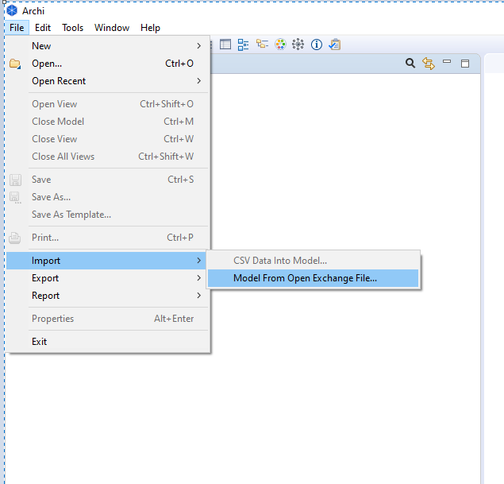
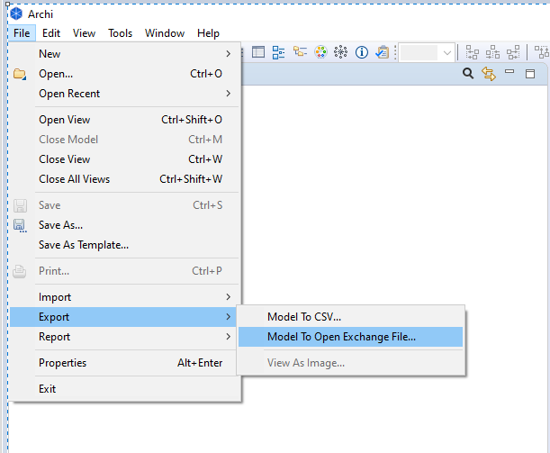
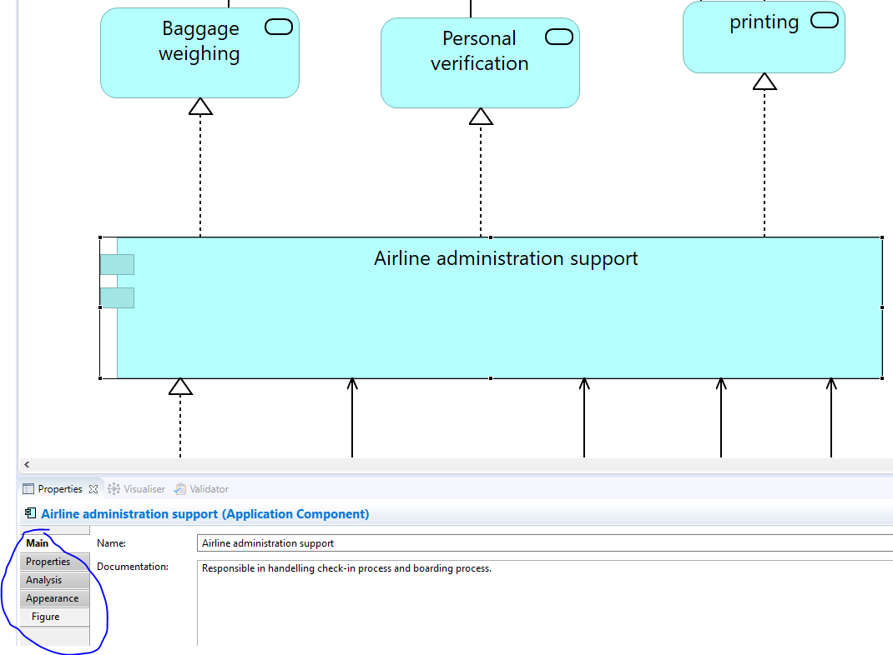

# Eam Pipeline Evaluation

Welcome to my JARVIS EAM pipeline evaluation and many thanks for participating!

For the evaluation I created several repositories as well as some EA models in ArchiMate which are described in the following.

TL;DR: If you just want to start working, here are the essentials:
1. Only work on the models stored in the develop and develop-full branch. Both store a complete and incomplete model. You can edit each model as you want to.
2. After you commited the changes, trigger the CD pipeline manually. You can find it at `137.226.17.141`  from within the SWC network. Use the jump server if you work from home.
3. Always work on the develop or develop-full branch! They store the project EA model. Do not work on the release or release-full branch directly. The models here are meant as read only and are only updated by the CD pipeline after a successful run.
4. Whenever you start your work, checkout the release or release-full branch and merge it the develop, respectively develop-full branch.
5. When you save your changes, do not use the save option provided by the Archi tool but export it to Open Exchange File format.
6. Communicate your work with the others! We cannot handle merge conflicts currently so please do not apply changes to the model in parallel but wait for the others to finish their editions. Then pull the new model from the release branch and merge it to the according develop branch. Believe me, you do not want to resolve merge conflicts in xml files.

### First steps

In order to work you need the following.

1. Download the archimate modelling suite from https://www.archimatetool.com/ .
2. Clone this git repository and checkout the develop or develop-full branch.
3. Open Archi, and click



4. Find the git folder in which the CentralMode.xml file is located and import it.
5. If you find a blank page on the right-hand side of the GUI, double click on Views -> Default Views in the model panel on the left-hand side. You might need to scroll to the right in order to find the elements displayed as I deleted elements on the left-hand side of the model.


6. When you want to save your changes **do not use the normal save operation provided by Archi!**. Export it to Open Exchange File...




### Models
There are 4 repositories used for EA models and 2 different models you can checkout, have a look at and work on it.

1. **The complete model**: <br>The complete model shows a complete case study of an airport departure system which we also used in the SoSym paper. It models different areas and stages a flight passenger sees from entering an airport up to entering his plane. The full model is saved in the *develop-full* and *release-full* branches.</br>
2. **The incomplete model**: <br>While I worked on the evaluation concepts I considered it difficult for you to work on a complete model. Especially as some of you do not have any experience with ArchiMate and EA modelling. For this I also created two branches, namely *develop* and *release* which store an ArchiMate model which contains a small subset of the complete model.</br>

While you play around with the EA models you can CRUD elements and relationships on both models as you want to. However, it might be helpful for you to have a look at the complete model and then trying to remodel some aspects in the incomplete model. Later I will give a short introduction into ArchiMate modeling. However, I find it interesting to see the results later in the model with respect to the fact that some of you do not have much or any experience at all in ArchiMate modelling. So please do not feel like you must model the aspects correctly but do it as you want to or think how to do it. Especially because EA modelling is a complex and difficult task, so you are not required to handle the craft correctly upfront.

### Pipeline setup

In order to understand the repo setup I will briefly explain how the pipeline works such that you do not need to find the information in my paper.

The pipeline uses three git repositories from which it pulls the artifacts it needs for the processing.

1. The **central EA model**. This is meant to model the organizational wide EA model, i.e. it is readable for all departments of an enterprise. It is stored in some release branch and is not edited manually by any architects. After a successful pipeline run the pipeline will deploy the new central EA model in this branch.
2. The **project EA model**. Each project contains a forked branch of the branch in which the central model is stored. In here the EA model which is edited by the architects is stored. After the pipeline is triggered it will checkout the model from this repository and the model from the central repository to compare both models with each other in order to detect the differences between both. If the project model complies to the quality standards it will be merged with the central model and later on deployed as the new central model in the central EA repository.
3. Config files, which just contain several config data used by the pipeline during the processing.

We conclude, that the edition process looks as follows:
1. The central model is stored in a git repository or branch. We call this central EA repository.
2. The central EA repository will be forked to a 2nd repository in which the project EA model will be stored. We call this the project EA repository.
3. The architect checks out the project EA model from the project EA repository and applies changes to it. When he is done he commits his changes and pushes the new model to the project EA repository. This push triggers the CD pipeline.
4. After the CD pipeline ran successfully it deploys the merged EA model in the central EA repository as the new central EA model.

### Evaluation process

One unsolved problem of our pipeline is the merge conflicts occurring in xml files, since we work with xml ArchiMate files. Due to this we have to adapt the process of your working during the evaluation. Even though this is contradictory to the idea of collaborative modelling we need to organize the order in which an EA model is edited in order to prevent (unresolvable) merge conflicts. So please follow the instructions as follows:

1. Ask in the telegram group if anyone has changed the EA model file you want to work on. Just if no one did and not doing it currently, then
2. checkout the **release/release-full** branch and pull the current model from remote
3. merge the changes to the **develop/develop-full** branch
4. make your changes and commit them immediately to the branch
7. trigger the pipeline (even though it is just a REST call I did find time to create script which triggers the pipeline)
8. when the pipeline finished successfully please tell the group that it finished. If not, please tell me in case that it looks like a bug.

Believe me, you do not want to resolve any merge conflicts in an ArchiMate model file. If you follow this process we should not run in this situation during the evaluation.

### Repository Setup
As explained in section *Pipeline setup* I created the following repository setup:
- **master**: only used for displaying README. Do not push anything in this repo, it is just meant as an entry point.
- **config**: represents the config repository. If not really necessary you will not need to touch anything here.
  Here you can find metric descriptions as well as some fictive role mappings I created for you. The roles are defined as following:
    - Solution architects: <br>Nils, Selin, Christian</br>
    - Enterprise architects: <br>Konrad, Andy, Peter</br>

  The roles are currently not differing in their meanings. I just created them upfront for the case that it makes
  sense to include different roles during the evaluation.
- **release-full**: Represents the central EA model repository of the complete model. **Please do not work on the model in this branch!**
- **release**: Represents the central EA model repository of the incomplete model. **Please do not work on the model in this branch!**
- **develop-full**: Represents the project EA model repository of the complete model. When you want to play around with the complete model, e.g. to create new aspects which are not covered in the model currently or remodel some, **this is the repository you want to checkout and work on**
- **develop**: Represents the project EA model repository of the incomplete model. When you want to model aspects in the incomplete model, **this is the repository you want to checkout and work on**

### Pipeline trigger
As mentioned before the pipeline is not triggered automatically (I will fix this if I can make it in time and let you know). Thus after you made your changes to a project EA model, please trigger the pipeline manually either by using the REST API, or using the JARVIS GUI. Both models, i.e. the complete and incomplete EA model, have an own pipeline which can be triggered. I deployed the pipelines at: `137.226.17.141`

**Note: The server is only accessible from within the SWC network!!**

In order to trigger the pipeline from HomeOffice, you must take use of an SSH socks proxy over our jump server:

```
ssh -D 12345 (or any port which is not used currently) <YOUR_USERNAME_AT_JUMP>@jump.swc.rwth-aachen.de

e.g.

ssh -D 12345 asabau@jump.swc.rwth-aachen.de
```

More information can be found under https://supp.swc.rwth-aachen.de/confluence/display/SWCServer/Route+HTTP+traffic+through+an+SWC+proxy+server .

### ArchiMate introduction

ArchiMate is an EA modelling language. EA modelling is a practice in which business and IT are modelled together in order to model the inerconnections between business and IT in an organization. For this purpose, ArchiMate differs between several types of nodes. I will not present all here, as this will go too much into detail but focus on the most relevant ones.

1. **Business**: The business level contains elements which model, as the names suggests, the business level of the organization. Here you can model aspects like business functions provided by the organization, business actors which are somehow related to the functions, business roles which define the role of business actors, business interfaces, etc. In ArchiMate business elements are per default colored yellowish.
2. **Application**: The application level shows the software side of the offered business services etc. Here you can find elements like application components composed of several application services and offering application interfaces, etc. So here we model for example the software view of payment system which is used in the enterprise to offer a business service. The application elements are modeled in a blueish color by default.
3. **Technology & Physical**: This layer models the hardware on which the applications of the application level runs. Technology and physical elements are modeled in a greenish color.

As the description above shows an ArchiMate model is typically modelled following a clear layer architecture. On the top most level the business level, as the most abstract layer, is modelled. On the next level below the business elements the application layer is set. On the lowermost level the technology and physical elements will be displayed. Thus, the application layer is like the interface between the technology level on which the business services are physically offered, and the business layer, which shows somewhat the "client view" of the services offered by an enterprise.

You can see this layer structure also in both models in the develop and develop-full branches.

The semantics in an ArchiMate model are built up by element types on the one hand, e.g. business actors modelling actors and business services modelling services on the business level, as well as relationship in between models. These relationships are:

- Composition
- Aggregation
- Assignment
- Realization
- Serving
- Access
- Influence
- Triggering
- Flow
- Specialization and
- Association as the weakest relationship of all.

Most relationships can be interpreted and are also displayed like the according UML class diagram associations, e.g. aggregation and composition. Some others, such as Triggering and Flow, have more specific meanings and have not a directly related meaning from the UML world. I will not go into detail of each relationship but will refer you to the specification of ArchiMate 3: https://pubs.opengroup.org/architecture/archimate3-doc/chap05.html#_Toc10045310

In Archi you can also change properties of elements and relationships, give them non-default colors etc. by clicking on the according element and using the few buttons on the left hand side of the element windows. You will need to define properties for the metrics as well.




#### ArchiMate models on technical level

Even though this is not important for you to work with ArchiMate models, as you should use the Archi tool for that, for the sake completeness I also want to give a brief explanation of the files we use in the pipeline.

ArchiMate is per se a Meta-model for EA models. On the technical level we use an open standard which implements this Meta-model speficiation with xml/xsd. This is also why you want to import and export the xml files instead of loading and saving Archi files. Even though Archi files are also xml documents they come with way more meta data as the OpenGroup xml standard files. If interested you can find the standard here: http://www.opengroup.org/xsd/archimate/
